# 十二、为什么均值重要

> 原文：[Why the Mean Matters](https://github.com/data-8/textbook/tree/gh-pages/chapters/12)

> 译者：[飞龙](https://github.com/wizardforcel)

> 协议：[CC BY-NC-SA 4.0](http://creativecommons.org/licenses/by-nc-sa/4.0/)

> 自豪地采用[谷歌翻译](https://translate.google.cn/)


在这个课程中，我们已经研究了几个不同的统计量，包括总编译距离，最大值，中位数和平均值。在关于随机性的明确假设下，我们绘制了所有这些统计量的经验分布。有些统计量，比如最大和总变异距离，分布明显偏向一个方向。但是，无论研究对象如何，样本均值的经验分布几乎总是接近钟形。

如果随机样本的性质是真的，不管总体如何，它都能成为一个有力的推理工具，因为我们通常不清楚总体中的数据。大型随机样本的均值分布属于这类性质。这就是随机抽样方法广泛用于数据科学的原因。

在本章中，我们将研究均值，以及我们可以说的一些东西，仅仅使用最基本的底层总体的假设。我们要解决的问题包括：

+   均值正好测量了什么？
+   大部分数据与平均值有多接近？
+   样本量如何与样本的均值相关？
+   为什么随机样本的经验分布出现钟形？
+   我们如何有效地使用抽样方法进行推理？

## 均值的性质

在这个课程中，我们可以互换地使用“average”和“mean”两个单词（译者注，在中文中都译为“均值”），后面也一样。 在你高中甚至更早的时候，你熟悉均值的定义。

定义：数值集合的均值是集合中所有元素的总和，除以集合中元素的数量。

`np.average`和`np.mean`方法返回数组的均值。

```py
not_symmetric = make_array(2, 3, 3, 9)
np.average(not_symmetric)
4.25
np.mean(not_symmetric)
4.25
```

### 基本性质

上面的定义和例子指出了均值的一些性质。

+   它不一定是集合中的一个元素。
+   即使集合的所有元素都是整数，也不一定是整数。
+   它在集合的最小值和最大值之间。
+   它不一定在两个极值的正中间；集合中一半的元素并不总是大于均值。
+   如果集合含有一个变量的值，以指定单位测量，则均值也具有相同的单位。

我们现在将研究一些其他性质，它有助于理解均值，并与其他统计量相关。

### 均值是个“平滑器”

你可以将均值视为“均衡”或“平滑”操作。 例如，将上面的`not_symmetric`中的条目设想为四个不同人的口袋中的美元。 为此，你先把所有的钱都放进一个大袋子，然后平均分配给四个人。 最开始，他们在口袋中装了不同数量的钱（2 美元，3 美元，3 美元和9 美元），但现在每个人都有平均数量 4.25 美元。

### 均值的性质

如果一个集合只包含 1 和 0，那么集合的总和就是集合中 1 的数量，集合的均值就是 1 的比例。

```py
zero_one = make_array(1, 1, 1, 0)
sum(zero_one)
3
np.mean(zero_one)
0.75
```

捏可以将 1 替换为布尔值`True`，0 替换为`False`。

```py
np.mean(make_array(True, True, True, False))
0.75
```

因为比例是均值的一个特例，随机样本均值的结果也适用于随机样本比例。

### 均值和直方图

集合`{2, 3, 3, 9}`的平均值是 4.25，这不是数据的“正中间的点”。 那么这是什么意思？

为了了解它，请注意，平均值可以用不同的方式计算。


最后一个表达式就是一个普遍事实的例子：当我们计算平均值时，集合中的每个不同的值都由它在集合中出现的时间比例加权。

这有一个重要的结果。 集合的平均值仅取决于不同的值及其比例，而不取决于集合中元素的数量。 换句话说，集合的平均值仅取决于集合中值的分布。

因此，如果两个集合具有相同的分布，则它们具有相同的均值。

例如，这里是另一个集合，它的分布与`not_symmetric`相同，因此均值也相同。

```py
not_symmetric
array([2, 3, 3, 9])
same_distribution = make_array(2, 2, 3, 3, 3, 3, 9, 9)
np.mean(same_distribution)
4.25
```

均值是分布直方图的物理属性。这里是`not_symmetric`的分布直方图，或者等价的`same_distribution`的分布直方图。

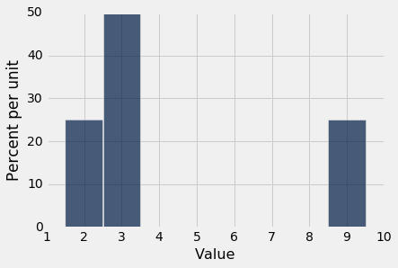

想象一下，直方图是由纸板组成的图形，它附着在一条线上，线沿着横轴延伸。并且，将这些条形想象为附加在值 2, 3 和 9 上的权重。假设你尝试在线上的某个点平衡这个图形。如果该点接近 2，图形就向右倾斜。如果该点接近 9，则图形就向左倾斜。之间的某个地方是这个数字取得平衡的点。这个点是 4.25，就是均值。

均值是直方图的重心或平衡点。

为了理解这是为什么，了解一些物理会有帮助。重心的计算与我们计算平均值的方法完全相同，通过将不同值按它们比例加权。

因为均值是一个平衡点，有时在直方图的底部显示为一个支点或三角形。

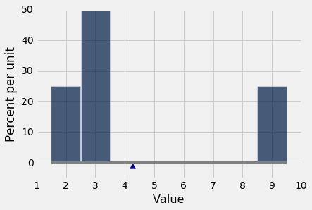

### 均值和中位数

如果一个学生的考试成绩低于平均水平，这是否意味着该学生在该考试中处于后一半？

对于学生来说，回答是“不一定”。 原因与直方图的平衡点即均值，和数据的“中间点”即中位数之间的关系有关。

通过这个关系很容易看到一个简单的例子。 这里是数组`symmetric`的集合`{2, 3, 3, 4}`的直方图。 分布对称于 3。均值和中位数都等于 3。

```py
symmetric = make_array(2, 3, 3, 4)
```

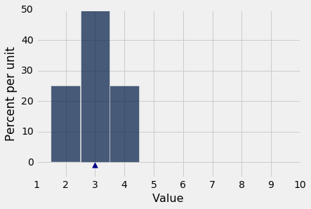

```py
np.mean(symmetric)
3.0
percentile(50, symmetric)
3
```

一般来说，对于对称分布，均值和中位数是相等的。

如果分布不对称呢？ 我们来比较`symmetric`和`not_symmetric`。

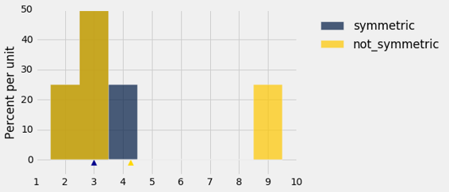

蓝色直方图表示原始的`symmetric`分布。 `not_symmetric `的金色从左端起始，和蓝色一样，但是最右边的条形到了数值 9。棕色部分是两个直方图重叠的位置。

蓝色分布的中位数和均值都等于 3。金色分布的中值也等于 3，尽管右半部分与左边的分布不同。

但金色分布的平均值不是 3：金色直方图在 3 时不平衡。平衡点已经向右移动到 4.25。

在金色分布中，4 个条目中有 3 个（75%）低于平均水平。 因此，低于平均分的学生可以放心。 他或她可能是班上的大多数人。

一般来说，如果直方图的一边有尾巴（整数属于是“偏斜的”），那么平均值就会从中间拉到尾巴的方向。

### 示例

`sf2015`表包含 2015 年旧金山城市员工的薪水和福利数据。与以前一样，我们将我们的分析仅限于那些等价于至少就业半年的人。

```py
sf2015 = Table.read_table('san_francisco_2015.csv').where('Salaries', are.above(10000))
```

我们前面看到了，最高薪资高于 60 万美元，但绝大多数雇员的薪资低于 30 万美元。

```py
sf2015.select('Total Compensation').hist(bins = np.arange(10000, 700000, 25000))
```

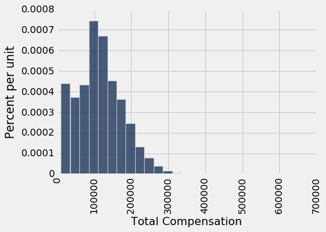

这个直方图向右偏斜；它的右侧有个尾巴。

平均值拉向了尾巴的方向。 所以我们预计平均薪酬会比中位数大，事实确实如此。

```py
compensation = sf2015.column('Total Compensation')
percentile(50, compensation)
110305.78999999999
np.mean(compensation)
114725.98411824222
```

大量总体的收入分布往往是右偏的。 当总体的大部分收入中到低，但很小一部分收入很高时，直方图的右侧有条细长的尾巴。

平均收入受这条尾巴的影响：尾巴向右延伸得越远，平均值就越大。 但中位数不受分布极值的影响。 这就是经济学家经常用收入分布的中位数来代替平均值的原因。

## 可变性

平均值告诉我们直方图平衡的位置。 但是在我们所看到的几乎所有的直方图中，值都位于均值的两边。 他们距离均值有多远？ 为了回答这个问题，我们将开发一个关于均值的可变性度量。

我们首先描述如何计算度量值。 然后我们就会明白，为什么这是很好的计算方法。

### 距离均值的偏差的大致大小

为了简单起见，我们将在简单数组`any_numbers `的上下文中开始计算，它由四个值组成。 你将会看到，我们的方法非常易于扩展到任何其他数组。

```py
any_numbers = make_array(1, 2, 2, 10)
```

我们的目标是，大致衡量这些数值离他们的平均水平有多远。 为了实现它，我们首先需要均值：

```py
# Step 1. The average.

mean = np.mean(any_numbers)
mean
3.75
```

接下来，我们来看看每个数值离均值有多远。 这些被称为到均值的偏差。 “到均值的偏差”只是每个值减去平均值。 `calculation_steps`表显示了结果。

```py
# Step 2. The deviations from average.

deviations = any_numbers - mean
calculation_steps = Table().with_columns(
        'Value', any_numbers,
        'Deviation from Average', deviations
        )
calculation_steps
```


| Value | Deviation from Average |
| --- | --- |
| 1 | -2.75 |
| 2 | -1.75 |
| 2 | -1.75 |
| 10 | 6.25 |

一些偏差是负的；它们对应于低于均值的值。 正的偏差对应于高于平均值的值。

要计算偏差有多大，计算偏差的平均值是很自然的。 但是当所有的偏差加在一起的时候，会发生一些有趣的事：

```py
sum(deviations)
0.0
```

正的偏差正好和负的偏差抵消。 无论列表的直方图是什么样子，所有的数字列表都是如此：到均值的偏差总和为零。

由于偏差的总和为零，偏差的均值也将为零：

```py
np.mean(deviations)
0.0
```

因此，偏差的均值不是偏差大小的有用度量。 我们真正想知道的是偏差有多大，不管它们是正的还是负的。 所以我们需要一种方法来消除偏差的符号。

有两种历史悠久的丢掉符号的方式：绝对值和平方。 事实证明，采用平方会构建一个度量，带有非常强大的性质，其中一些我们将在这个课程中学习。

所以让我们计算所有偏差的平方，来消除符号。 那么我们将计算平方的均值：

```py
# Step 3. The squared deviations from average

squared_deviations = deviations ** 2
calculation_steps = calculation_steps.with_column(
   'Squared Deviations from Average', squared_deviations
    )
calculation_steps
```


| Value | Deviation from Average | Squared Deviations from Average |
| --- | --- | --- |
| 1 | -2.75 | 7.5625 |
| 2 | -1.75 | 3.0625 |
| 2 | -1.75 | 3.0625 |
| 10 | 6.25 | 39.0625 |

```py
# Step 4. Variance = the mean squared deviation from average

variance = np.mean(squared_deviations)
variance
13.1875
```

方差：上面计算的偏差平方的均值称为方差。

虽然方差确实给了我们延展度的概念，但它和原始变量不是一个量纲，因为它的单位是原始变量的平方。 这使得解释非常困难。

所以我们通过计算方差的算术平方根的来返回原来的量纲：

```py
# Step 5.
# Standard Deviation:    root mean squared deviation from average
# Steps of calculation:   5    4      3       2             1

sd = variance ** 0.5
sd
3.6314597615834874
```

### 标准差

我们刚计算出来的数量叫做列表的标准差，简写为 SD。 它大致衡量列表中的数字与其平均水平的差距。

定义：列表的 SD 定义为方差（偏差平方的均值）的算术平方根。这很拗口。 但是从左到右阅读，你需要执行一系列的步骤的计算。

计算：上述五个步骤会产生 SD。 你还可以使用函数`np.std`来计算数组中值的标准差：

```py
np.std(any_numbers)
3.6314597615834874
```

> 译者注：写在一起就是`np.mean((arr - arr.mean()) ** 2) ** 0.5`。

### 使用 SD

要看看我们可以从SD中学到什么，让我们转向一个比`any_numbers`更有趣的数据集。 `nba13`表包含了 2013 年 NBA 的球员数据。对于每个球员来说，表格中记录了球员通常的位置，他的身高（英寸），体重（磅）和年龄。

```py
nba13 = Table.read_table('nba2013.csv')
nba13
```


| Name | Position | Height | Weight | Age in 2013 |
| --- | --- | --- | --- | --- |
| DeQuan Jones | Guard | 80 | 221 | 23 |
| Darius Miller | Guard | 80 | 235 | 23 |
| Trevor Ariza | Guard | 80 | 210 | 28 |
| James Jones | Guard | 80 | 215 | 32 |
| Wesley Johnson | Guard | 79 | 215 | 26 |
| Klay Thompson | Guard | 79 | 205 | 23 |
| Thabo Sefolosha | Guard | 79 | 215 | 29 |
| Chase Budinger | Guard | 79 | 218 | 25 |
| Kevin Martin | Guard | 79 | 185 | 30 |
| Evan Fournier | Guard | 79 | 206 | 20 |

（省略了 495 行）

这里是球员身高的直方图。

```py
nba13.select('Height').hist(bins=np.arange(68, 88, 1))
```

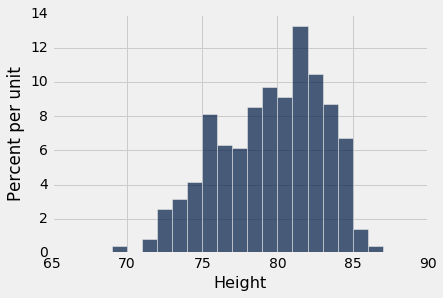

NBA 球员身材高大并不奇怪！ 他们的平均身高只有 79 英寸（6'7"），比美国男子的平均身高高出 10 英寸。

```py
mean_height = np.mean(nba13.column('Height'))
mean_height
79.065346534653472
```

球员的身高距离平均有多远？ 这通过身高的 SD 来测量，大约是 3.45 英寸。

```py
sd_height = np.std(nba13.column('Height'))
sd_height
3.4505971830275546
```

俄克拉荷马雷霆的高个中锋哈希姆·塔比特（Hasheem Thabeet）是最高的球员，身高 87 英寸。

```py
nba13.sort('Height', descending=True).show(3)
```

| Name | Position | Height | Weight | Age in 2013 |
| --- | --- | --- | --- | --- |
| Hasheem Thabeet | Center | 87 | 263 | 26 |
| Roy Hibbert | Center | 86 | 278 | 26 |
| Tyson Chandler | Center | 85 | 235 | 30 |

（省略了 502 行）

Thabeet 比平均身高高了大约 8 英寸。

```py
87 - mean_height
7.9346534653465284
```

这个就是距离均值的偏差，大约是 2.3 乘标准差。

```py
(87 - mean_height)/sd_height
2.2995015194397923
```

换句话说，最高球员的身高比均值高了 2.3 个 SD。

以赛亚·托马斯（Isaiah Thomas）身高 69 英寸，是 2013 年 NBA 最矮的球员之一。他的身高比均值低了 2.9 个 SD。

```py
nba13.sort('Height').show(3)
```


| Name | Position | Height | Weight | Age in 2013 |
| --- | --- | --- | --- | --- |
| Isaiah Thomas | Guard | 69 | 185 | 24 |
| Nate Robinson | Guard | 69 | 180 | 29 |
| John Lucas III | Guard | 71 | 157 | 30 |

（省略了 502 行）

```py
(69 - mean_height)/sd_height
-2.9169868288775844
```

我们观察到，最高和最矮的球员都距离平均身高只有几个标准差。 这是例子，说明了为什么 SD 是延展度的有效度量。无论直方图的形状如何，平均值和 SD 一起告诉你很多东西，关于直方图在数轴上的位置。

### 使用 SD 度量延展度的最主要原因

非正式声明：在所有的数值数据集中，大部分条目都在“均值上下几个标准差”的范围内。

现在，先克制住自己，不要了解“散”，“少”等模糊词的确切含义。 我们将在本节的后面进行详细说明。 我们仅仅在更多示例的背景下研究这个陈述。

我们已经看到，所有 NBA 球员的身高都在“均值上下几个标准差”的范围内。

那年龄呢？ 这里是分布的直方图，以及年龄的平均值和标准差。

```py
nba13.select('Age in 2013').hist(bins=np.arange(15, 45, 1))
```

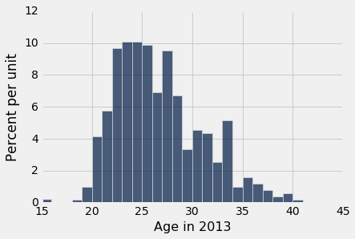

```py
ages = nba13.column('Age in 2013')
mean_age = np.mean(ages)
sd_age = np.std(ages)
mean_age, sd_age
(26.19009900990099, 4.3212004417203067)
```

平均年龄只有 26 岁，标准差大约是 4.3 岁。

年龄与均值相差多远？ 就像我们对身高所做的那样，让我们看看两个年龄的极端值。

Juwan Howard 是年龄最大的球员 40 岁。

```py
nba13.sort('Age in 2013', descending=True).show(3)
```


| Name | Position | Height | Weight | Age in 2013 |
| --- | --- | --- | --- | --- |
| Juwan Howard | Forward | 81 | 250 | 40 |
| Marcus Camby | Center | 83 | 235 | 39 |
| Derek Fisher | Guard | 73 | 210 | 39 |

（省略了 502 行）

Howard 的年龄比均值高了 3.2 个标准差。

```py
(40 - mean_age)/sd_age
3.1958482778922357
```

年龄最小的是 15 岁的 Jarvis Varnado，他当年在迈阿密热火队（Miami Heat）夺得了 NBA 总冠军。 他的年龄比均值低了 2.6 个标准差。

```py
nba13.sort('Age in 2013').show(3)
```


| Name | Position | Height | Weight | Age in 2013 |
| --- | --- | --- | --- | --- |
| Jarvis Varnado | Forward | 81 | 230 | 15 |
| Giannis Antetokounmpo | Forward | 81 | 205 | 18 |
| Sergey Karasev | Guard | 79 | 197 | 19 |

（省略了 502 行）

```py
(15 - mean_age)/sd_age
-2.5895811038670811
```

对于高度和年龄，我们观察到的东西非常普遍。 对于所有列表，大部分条目都不超过平均值 2 或 3 个标准差。

### 切比雪夫边界

俄罗斯数学家切比雪夫（Pafnuty Chebychev，1821-1894）证明了这个结论，使我们的粗略陈述更加精确。

对于所有列表和所有数字`z`，“均值上下`z`个标准差”范围内的条目比例至少为 。

值得注意的是，结果给出了一个界限，而不是一个确切的数值或近似值。

是什么让结果变得强大，对于所有列表来说都是这样呢 - 所有的分布，无论多么不规则？

具体来说，对于每个列表：

在“均值上下两个标准差”范围内的比例至少是`1 - 1/4 = 0.75`

在“均值上下三个标准差”范围内的比例至少为`1 - 1/9 ≈ 0.89`

在“均值上下 4.5 个标准差”范围内的比例至少为`1 - 1/4.5^2 ≈ 0.95`

如上所述，切比雪夫的结果给出了一个下界，而不是一个确切的答案或近似值。例如，“均值上下两个标准差”范围内的条目百分比可能比 75% 大得多。但它不会更小。

### 标准单位

在上面的计算中，`z`的数量是标准单位，高于平均水平的标准差的数量。

标准单位的某些值是负值，对应于低于均值的原始值。 标准单位的其他是正值。 但是无论列表的分布如何，切比雪夫边界意味着标准单位一般在`(-5, 5)`范围内。

要将一个值转换为标准单位，首先要求出距离平均值有多远，然后将该偏差与标准差比较。


我们将会看到，标准单位经常用于数据分析。 所以定义一个函数，将数值的数组转换为标准单位是很有用的。

```py
def standard_units(numbers_array):
    "Convert any array of numbers to standard units."
    return (numbers_array - np.mean(numbers_array))/np.std(numbers_array)    
```

### 示例

我们在前面的章节中看到，`united`表包含了`Delay`列，包括 2015 年夏天联合航空数千航班的起飞延误时间，以分钟为单位。我们将创建一个名为`Delay (Standard Units)`的新列， 通过将函数`standard_units`应用于`Delay`列。 这使我们可以看到所有延误时间（分钟）以及标准单位的相应值。

```py
united = Table.read_table('united_summer2015.csv')
united = united.with_column(
    'Delay (Standard Units)', standard_units(united.column('Delay'))
)
united
```


| Date | Flight Number | Destination | Delay | Delay (Standard Units) |
| --- | --- | --- | --- | --- |
| 6/1/15 | 73 | HNL | 257 | 6.08766 |
| 6/1/15 | 217 | EWR | 28 | 0.287279 |
| 6/1/15 | 237 | STL | -3 | -0.497924 |
| 6/1/15 | 250 | SAN | 0 | -0.421937 |
| 6/1/15 | 267 | PHL | 64 | 1.19913 |
| 6/1/15 | 273 | SEA | -6 | -0.573912 |
| 6/1/15 | 278 | SEA | -8 | -0.62457 |
| 6/1/15 | 292 | EWR | 12 | -0.117987 |
| 6/1/15 | 300 | HNL | 20 | 0.0846461 |
| 6/1/15 | 317 | IND | -10 | -0.675228 |

（省略了 13815 行）

我们看到的标准单位与我们根据切比雪夫边界的预期一致。 大部分都是相当小的值；只有一个大于 6。

但是，当我们将延误时间从高到低排序时，会发生一些惊人的事情。 我们看到的标准单位是非常高的！

```py
united.sort('Delay', descending=True)
```

| Date | Flight Number | Destination | Delay | Delay (Standard Units) |
| --- | --- | --- | --- | --- |
| 6/21/15 | 1964 | SEA | 580 | 14.269 |
| 6/22/15 | 300 | HNL | 537 | 13.1798 |
| 6/21/15 | 1149 | IAD | 508 | 12.4453 |
| 6/20/15 | 353 | ORD | 505 | 12.3693 |
| 8/23/15 | 1589 | ORD | 458 | 11.1788 |
| 7/23/15 | 1960 | LAX | 438 | 10.6722 |
| 6/23/15 | 1606 | ORD | 430 | 10.4696 |
| 6/4/15 | 1743 | LAX | 408 | 9.91236 |
| 6/17/15 | 1122 | HNL | 405 | 9.83637 |
| 7/27/15 | 572 | ORD | 385 | 9.32979 |

（省略了 13815 行）

这表明，数据有可能高于均值很多个标准差（对于延误了 10 个小时的航班）。 延误的最高值超过 14 个标准单位。

然而，这些极端值的比例很小，切比雪夫边界仍然是真的。 例如，让我们计算在“均值上下三个标准差”范围内的延误百分比。 这与标准单位在`(-3, 3)`范围内的时间百分比相同。 这大约是 98%，计算在下面，和切比雪夫边界“至少 89%”一致。

```py
within_3_sd = united.where('Delay (Standard Units)', are.between(-3, 3))
within_3_sd.num_rows/united.num_rows
0.9790235081374322
```

延误时间的直方图如下所示，横轴以标准单位表示。 从上表中可以看出，右边的尾巴一直延伸到`z = 14.27 `个标准单位（580 分钟）。 在`z = -3`到`z = 3`范围外的直方图面积大约是 2%，加起来非常小，在直方图中几乎不可见。

```py
united.hist('Delay (Standard Units)', bins=np.arange(-5, 15.5, 0.5))
plots.xticks(np.arange(-6, 17, 3));
```

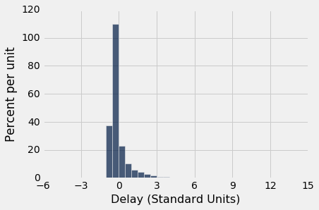

## 标准差和正态曲线

我们知道均值是直方图的平衡点。 标准差与平均值不同，通常不容易通过查看直方图来识别。

然而，有一种分布形状，它的标准差与平均值几乎一样清晰可辨。 这是钟形分布。 本节将查看该形状，因为它经常出现在概率直方图中，也出现在一些数据的直方图中。

### 数据的大致钟形的直方图

让我们看看母亲的身高分布，它们在我们熟悉的 1174 对母亲和新生儿的样本中。母亲的平均身高为 64 英寸，SD 为 2.5 英寸。 与篮球运动员的身高不同，母亲身高关于钟形曲线中的平均值对称分布。

```py
baby = Table.read_table('baby.csv')
heights = baby.column('Maternal Height')
mean_height = np.round(np.mean(heights), 1)
mean_height
64.0
sd_height = np.round(np.std(heights), 1)
sd_height
2.5
baby.hist('Maternal Height', bins=np.arange(55.5, 72.5, 1), unit='inch')
positions = np.arange(-3, 3.1, 1)*sd_height + mean_height
plots.xticks(positions);
```

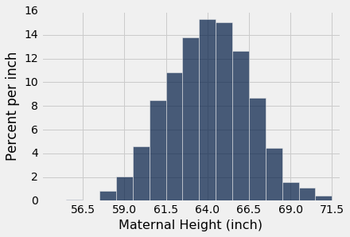

上面单元格中的最后两行代码更改了横轴的标签。 现在，对于`z=0, ±1, ±2, ±3`，标签对应于“标签上下`z`个标准差”。 由于分布的形状，“中心”具有明确的含义，在 64 处清晰可见。

### 如何定位钟形曲线上的 SD

要看 SD 如何与曲线相关，请从曲线顶部开始，向右看。 请注意，曲线有一个地方，从看起来像“倒扣的杯子”，变为“朝右的杯子”。 在形式上，曲线有一个拐点。 这个点高于均值一个 SD。 这是`z = 1`的点，即“均值加一个标准差”，为 66.5 英寸。

在均值的左边也对称，拐点在`z = -1`处，也就是“均值减一个标准差”，为 61.5 英寸。

一般来说，对于钟形分布，SD 是均值和任一侧的拐点之间的距离。

### 标准正态曲线

除了轴上的标签，我们所看到的所有钟形直方图，看起来基本相同。 的确，通过适当地重新标记坐标轴，从所有这些曲线中，实际上只能绘制一条曲线。

为了绘制这条基本曲线，我们将使用标准单位，我们可以将每个列表转换成它。所得到的曲线因此被称为标准正态曲线。

标准正态曲线的方程令人印象深刻。 但是现在，最好把它看作是变量直方图的平滑轮廓，变量以标准单位测量并具有钟形分布。


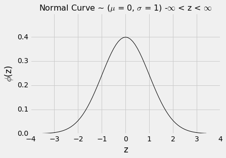

与往常一样，当你检查新的直方图时，首先查看横轴。在标准正态曲线的横轴上，这些值是标准单位。

这里是曲线的一些属性。有些是通过观察显而易见的，有些则需要大量的数学才能建立起来。

曲线下面的总面积是1.所以你可以把它看作是绘制为密度标度的直方图。

曲线是对称的。所以如果一个变量具有这个分布，它的平均值和中位数都是 0。

曲线的拐点在 -1 和 +1 处。

如果一个变量具有这种分布，那么它的 SD 是 1。正态曲线是 SD 清晰可辨的极少数分布之一。

由于我们将曲线视为平滑的直方图，因此我们希望用曲线下方的面积来表示数据总量的比例。

平滑曲线下的面积通常是通过微积分来计算的，使用一种称为积分的方法。然而，一个数学的事实是，标准的正态曲线不能通过任何微积分方式来积分。

因此，曲线下方的面积必须近似。这就是几乎所有的统计教科书，都带有曲线下方的面积的原因。这也是所有统计系统，包括 Python 模块在内，都包含提供这些面积的优秀近似的方法的原因。

```py
from scipy import stats
```

### 标准正态的累积分布函数（CDF）

用于求出正态曲线下的面积的基本函数是`stats.norm.cdf`。 它接受一个数值参数，并返回曲线下，该数值的左侧的所有面积。 它在形式上被称为标准正态曲线的“累积分布函数”。 在口语里缩写为 CDF。

让我们使用这个函数来求出标准正态曲线下，`z=1`左侧的面积。

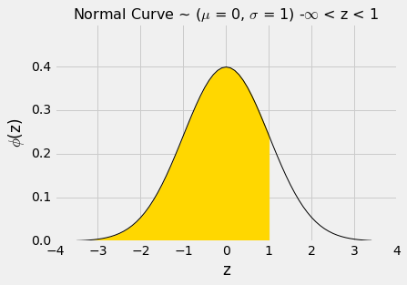

阴影区域的数值可以通过调用`stats.norm.cdf`来求出。

```py
stats.norm.cdf(1)
0.84134474606854293
```

这大概是 84%。 现在我们可以使用曲线的对称性，以及曲线下面的总面积为 1 事实，来求出其他面积。

`z = 1`右侧的面积大概是`100% - 84% = 16%`。

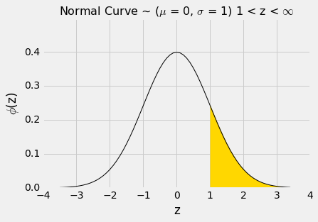

```py
1 - stats.norm.cdf(1)
0.15865525393145707
```

`z = -1`和`z = 1`之间的面积可以用几种不同的方式来计算。 它是下面的曲线下方的金色区域。

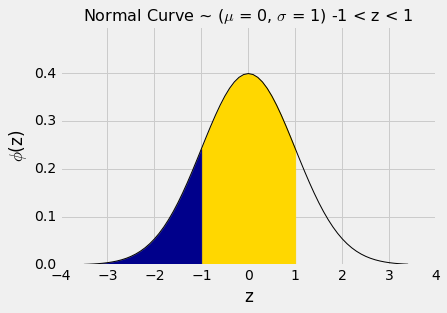

例如，我们可以将面积计算为“`100% -`两个相等的尾巴”，结果大致是`100% - 2X16% = 68%`。

或者我们可以注意到，`z = 1`和`z = -1`之间的区域等于`z = 1`左边的所有区域，减去`z = -1`左边的所有区域。

```py
stats.norm.cdf(1) - stats.norm.cdf(-1)
0.68268949213708585
```

通过类似的计算，我们看到`-2`和`2`之间的区域大约是 95%。

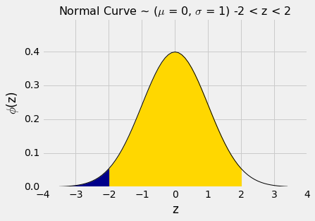

```py
stats.norm.cdf(2) - stats.norm.cdf(-2)
0.95449973610364158
```

换句话说，如果一个直方图大致是钟形，那么在“均值上下两个标准差”范围内的数据比例大约是 95%。

这比切比雪夫的下界 75% 还要多。 切比雪夫边界较弱，因为它必须适用于所有的分布。 如果我们知道一个分布是正态的，那么我们就有很好的比例近似，而不仅仅是边界。

下表比较了我们对所有分布和正态分布的了解。 请注意，当`z = 1`时，切比雪夫的边界是正确的，但没有启发性。


| Percent in Range | All Distributions: Bound | Normal Distribution: Approximation |
| --- | --- | --- |
| 均值上下一个标准差 | 至少 0% | 约 68% |
| 均值上下两个标准差 | 至少 75% | 约 95% |
| 均值上下三个标准差 | 至少 88.888...% | 约 99.73% |

## 中心极限定律

我们在本课程中看到的很少数据直方图是钟形的。 当我们遇到一个钟形的分布时，它几乎总是一个基于随机样本的统计量的经验直方图。

下面的例子显示了两个非常不同的情况，其中在这样的直方图中出现了近似的钟形。

### 轮盘赌的净收益

在前面的章节中，如果我们在轮盘的不同轮次上重复下相同的赌注，那么我们所花费的总金额的粗略形状就会成为钟形。

```py
wheel
```

| Pocket | Color |
| --- | --- |
| 0 | green |
| 00 | green |
| 1 | red |
| 2 | black |
| 3 | red |
| 4 | black |
| 5 | red |
| 6 | black |
| 7 | red |
| 8 | black |

（省略了 28 行）

回想一下，红色的下注返回相等的钱，1 比 1。我们定义的函数`red_winnings`返回对红色下注一美元的净收益。具体来说，该函数将颜色作为参数，如果颜色为红色，则返回 1。 对于所有其他颜色，它返回 -1。

```py
def red_winnings(color):
    if color == 'red':
        return 1
    else:
        return -1
```

`red`表展示了红色情况下，每个口袋的奖金。

```py
red = wheel.with_column(
    'Winnings: Red', wheel.apply(red_winnings, 'Color')
    )
red
```

| Pocket | Color | Winnings: Red |
| --- | --- | --- |
| 0 | green | -1 |
| 00 | green | -1 |
| 1 | red | 1 |
| 2 | black | -1 |
| 3 | red | 1 |
| 4 | black | -1 |
| 5 | red | 1 |
| 6 | black | -1 |
| 7 | red | 1 |
| 8 | black | -1 |

（省略了 28 行）

你在赌注上的净收益`Winnings: Red`的随机抽样。 有 1/18 的几率赚一美元，20/38 的几率损失一美元。 这个概率分布显示在下面的直方图中。

```py
red.select('Winnings: Red').hist(bins=np.arange(-1.5, 1.6, 1))
```

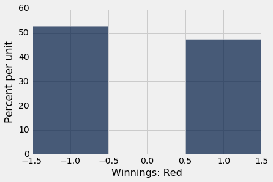

现在假设你多次对红色下注。 你的净收益将是来自上述分布的，多个带放回随机抽样的总和。

这将需要一些数学，来列出净收益的所有可能值，以及所有的记录。 我们不会那样做；相反，我们将通过模拟来逼近概率分布，就像我们在这个过程中一直做的那样。

下面的代码模拟你的净收益，如果你在轮盘赌的 400 个不同的轮次中，对红色下注一美元。

```py
num_bets = 400
repetitions = 10000

net_gain_red = make_array()

for i in np.arange(repetitions):
    spins = red.sample(num_bets)
    new_net_gain_red = spins.column('Winnings: Red').sum()
    net_gain_red = np.append(net_gain_red, new_net_gain_red)


results = Table().with_column(
    'Net Gain on Red', net_gain_red
    )
results.hist(bins=np.arange(-80, 50, 6))
```

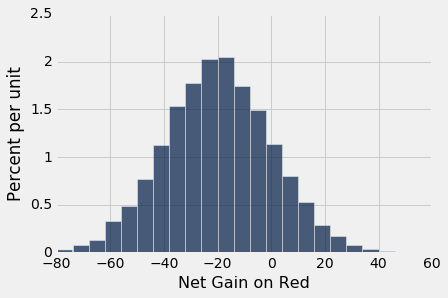

这是一个大致钟形的直方图，即使我们正在绘制的分布并不是钟形。

中心。分布集中在`-$20`附近。 要知道为什么，请注意，你的奖金在 18/38 左右的下注中为 1 美元，剩下的 20/38 则为负一美元。 所以每个一美元赌注的平均奖金大概是 -5.26 美分：

```py
average_per_bet = 1*(18/38) + (-1)*(20/38)
average_per_bet
-0.05263157894736842
```

因此，在 400 次下注中，你预计净收益大约是 21 美元。

```py
400 * average_per_bet
-21.052631578947366
```

为了确认，我们可以计算 10,000 次模拟净收益的平均值：

```py
np.mean(results.column(0))
-20.8992
```

延展。让你的眼睛沿着曲线从中心开始，注意到拐点在 0 附近。在钟形曲线上，SD 是中心到拐点的距离。 中心大概是 -20 美元，这意味着分布的标准差大约是 20 美元。

在下一节中，我们将看到 20 美元是怎么来的。 现在，让我们通过简单计算 10,000 个模拟净收益的 SD 来证实我们的观察：

```py
np.std(results.column(0))
20.043159415621083
```

总结。 400 次下注的净收益是每个单独赌注的 400 个奖金的总和。 这个总和的概率分布近似正态，我们可以近似它的均值和标准差。

### 平均航班延误

`united`表包含 2015 年夏季旧金山机场出发的 13,825 个联合航空国内航班的出发延误数据。正如我们以前所见，延误的分布的右侧有着很长的尾巴。

```py
united = Table.read_table('united_summer2015.csv')
united.select('Delay').hist(bins=np.arange(-20, 300, 10))
```

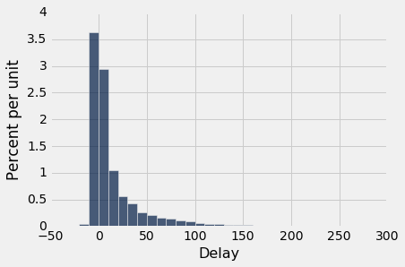

平均延误约为 16.6 分钟，SD 约为 39.5 分钟。 注意 SD 与平均值相比有多大。 但是右侧的较大偏差会产生影响，尽管它们在数据中占很小的比例。

```py
mean_delay = np.mean(united.column('Delay'))
sd_delay = np.std(united.column('Delay'))

mean_delay, sd_delay
(16.658155515370705, 39.480199851609314)
```

现在假设我们随机抽取了 400 个延误。 如果你愿意，你可以无放回抽样，但是结果与放回抽样非常相似。 如果你从 13,825 个中无放回地抽取几百个，那么每当你抽出一个值时，几乎不会改变总体。

在样本中，平均延误会是多少？ 我们预计在 16 或 17 左右，因为这是总体的均值。 但可能会有些偏差。 让我们看看我们通过抽样得到了什么。 我们将处理`delay `表，仅包含延迟的列。

```py
delay = united.select('Delay')
np.mean(delay.sample(400).column('Delay'))
16.68
```

样本均值根据样本的出现方式而变化，因此我们将重复模拟抽样过程，并绘制样本均值的经验直方图。 这是样本均值的概率直方图的近似值。

```py
sample_size = 400
repetitions = 10000

means = make_array()

for i in np.arange(repetitions):
    sample = delay.sample(sample_size)
    new_mean = np.mean(sample.column('Delay'))
    means = np.append(means, new_mean)

results = Table().with_column(
    'Sample Mean', means
)
results.hist(bins=np.arange(10, 25, 0.5))
```

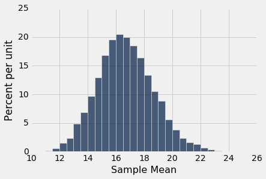

即使我们从非常偏斜的分布抽样，我们再次看到了大致的钟形。 正如我们所期望的那样，这个钟形的中心在 16 到 17 之间。

### 中心极限定律

钟形出现在这样的环境中的原因，是一个概率理论的显着结果，称为中心极限定律。

中心极限定理表明，无论用于抽取样本的总体分布如何，带放回抽取的大型随机样本的总和或均值的概率分布大致是正态的。

我们在研究切比雪夫边界时指出，不管总体分布如何，结果都可以应用于随机样本，这非常强大，因为在数据科学中，我们很少知道总体的分布。

如果我们有一个大型随机样本，那么中心极限定理就能够在总体知识很少的情况下进行推理。 这就是它是统计推断领域的核心的原因。

### 紫色的花的分布

回忆孟德尔的豌豆植物的花朵颜色的概率模型。 该模型表明，植物的花朵颜色类似于来自`{紫色，紫色，紫色，白色}`的带放回随机抽样。

在植物的大型样本中，紫色的花约有多少比例？ 我们预计答案约为 0.75，模型中紫色的比例。 而且，由于比例是均值，中心极限定理表明，紫色的样本比例的分布大致是正态的。

我们可以通过模拟来确认。 我们来模拟 200 株植物样本中紫色的花的比例。

```py
colors = make_array('Purple', 'Purple', 'Purple', 'White')

model = Table().with_column('Color', colors)

model
```


| Color |
| --- |
| Purple |
| Purple |
| Purple |
| White |

```py
props = make_array()

num_plants = 200
repetitions = 10000

for i in np.arange(repetitions):
    sample = model.sample(num_plants)
    new_prop = np.count_nonzero(sample.column('Color') == 'Purple')/num_plants
    props = np.append(props, new_prop)

results = Table().with_column('Sample Proportion: 200', props)
results.hist(bins=np.arange(0.65, 0.85, 0.01))
```

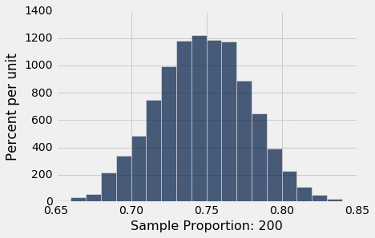

正如你所期望的那样，中央极限定理预测了，正态曲线再次集中于 0.75 左右。

如果我们增加样本量，这个分布如何变化？ 让我们再次运行代码，样本量为 800 ，并将模拟结果收集在同一个表中，我们在里面收集了样本量为 200 的模拟结果。我们使重复次数与之前相同，以便两列具有相同的长度。

```py
props2 = make_array()

num_plants = 800

for i in np.arange(repetitions):
    sample = model.sample(num_plants)
    new_prop = np.count_nonzero(sample.column('Color') == 'Purple')/num_plants
    props2 = np.append(props2, new_prop)

results = results.with_column('Sample Proportion: 800', props2)
results.hist(bins=np.arange(0.65, 0.85, 0.01))
```

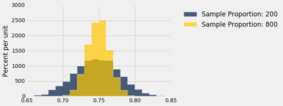

两个分布都大致是正态，但一个比另一个更窄。 样本量为 800 的比例，比样本量为 200 的比例更紧密地聚集在 0.75 左右。增加样本量可以减少样本比例的可变性。

这应该不会令人惊讶。 我们多次产生了这样的直觉，更大的样本量通常会降低统计量的可变性。 然而，在样本均值的案例中，我们可以量化样本量和可变性之间的关系。

样本量究竟是如何影响样本均值或比例的可变性呢？ 这是我们将在下一节中讨论的问题。

## 样本均值的可变性

根据中心极限定理，大型随机样本的均值的概率分布是大致正态的。 钟形曲线以总体平均值为中心。 一些样本均值较高，有些则较低，但距离总体均值的偏差在两边大致对称，正如我们已经看到的那样。 形式上，概率论表明样本均值是总体均值的无偏估计。

在我们的模拟中，我们也注意到较大样本的均值，相对较小样本的平均值更倾向于紧密聚集于总体均值附近。 在本节中，我们将量化样本均值的可变性，并建立可变性和样本量之间的关系。

我们从航班延误表开始。 平均延误时间约为 16.7 分钟，延误分布右倾。

```py
united = Table.read_table('united_summer2015.csv')
delay = united.select('Delay')
pop_mean = np.mean(delay.column('Delay'))
pop_mean
16.658155515370705
```

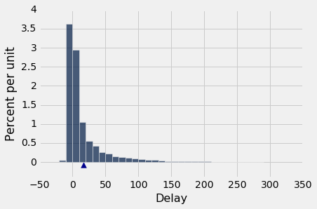

现在我们来随机抽样，来查看样本均值的概率分布。 像往常一样，我们将使用模拟来得到这种分布的经验近似。

我们将定义一个函数`simulate_sample_mean`来实现，因为我们将在稍后改变样本量。 参数是表的名称，包含变量的列标签，样本量和模拟次数。

```py
"""Empirical distribution of random sample means"""

def simulate_sample_mean(table, label, sample_size, repetitions):

    means = make_array()

    for i in range(repetitions):
        new_sample = table.sample(sample_size)
        new_sample_mean = np.mean(new_sample.column(label))
        means = np.append(means, new_sample_mean)

    sample_means = Table().with_column('Sample Means', means)

    # Display empirical histogram and print all relevant quantities
    sample_means.hist(bins=20)
    plots.xlabel('Sample Means')
    plots.title('Sample Size ' + str(sample_size))
    print("Sample size: ", sample_size)
    print("Population mean:", np.mean(table.column(label)))
    print("Average of sample means: ", np.mean(means))
    print("Population SD:", np.std(table.column(label)))
    print("SD of sample means:", np.std(means))
```

让我们模拟 100 个延误的随机样本的均值，然后是 400 个，最后是 625 个延误的均值。 我们将对这些过程中的每一个执行 10,000 次重复。 `xlim`和`ylim`在所有图表中设置一致的坐标轴，以便比较。 你可以忽略每个单元格中的这两行代码。

```py
simulate_sample_mean(delay, 'Delay', 100, 10000)
plots.xlim(5, 35)
plots.ylim(0, 0.25);
Sample size:  100
Population mean: 16.6581555154
Average of sample means:  16.662059
Population SD: 39.4801998516
SD of sample means: 3.90507237968
```

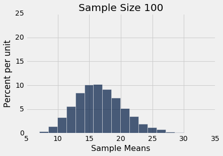

```py
simulate_sample_mean(delay, 'Delay', 400, 10000)
plots.xlim(5, 35)
plots.ylim(0, 0.25);
Sample size:  400
Population mean: 16.6581555154
Average of sample means:  16.67117625
Population SD: 39.4801998516
SD of sample means: 1.98326299651
```

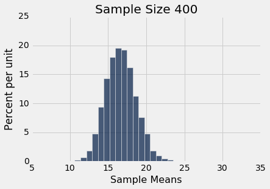

```py
simulate_sample_mean(delay, 'Delay', 625, 10000)
plots.xlim(5, 35)
plots.ylim(0, 0.25);
Sample size:  625
Population mean: 16.6581555154
Average of sample means:  16.68523712
Population SD: 39.4801998516
SD of sample means: 1.60089096006
```

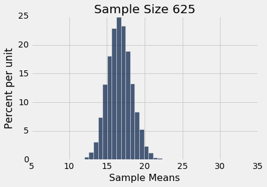

你可以在实践中看到中心极限定律 - 样本均值的直方图是大致正态的，即使延误本身的直方图与正态分布相差甚远。

你还可以看到，样本均值的三个直方图中的每一个中心都非常接近总体均值。 在每种情况下，“样本均值的均值”非常接近 16.66 分钟，是总体均值。 每个直方图上方的打印输出都提供了这两个值。 像预期一样，样本均值是对总体均值的无偏估计。

### 所有样本均值的 SD

随着样本量的增加，你还可以看到直方图变窄，因此更高。 我们之前已经看到，但现在我们将更加关注延展度的度量。

所有延误总体的标准差约为 40 分钟。

```py
pop_sd = np.std(delay.column('Delay'))
pop_sd
39.480199851609314
```

看看上面的样本均值的直方图中的标准差。在这三个里面，延误总体的标准差约为 40 分钟，因为所有的样本都来自同一个总体。

现在来看，样本量为 100 时，所有 10,000 个样本均值的标准差。标准差是总体标准差的十分之一。当样本量为 400 时，所有样本均值的标准差约为总体标准差的二十分之一。当样本量为 625 时，样本均值的标准差为总体标准差的二十五分之一。


将样本均值的经验分布的标准差与“总体标准差除以样本量的平方根”的数量进行比较，似乎是一个好主意。

这里是数值。对于第一列中的每个样本量，抽取 10,000 个该大小的随机样本，并计算 10,000 个样本均值。第二列包含那些 10,000 个样本均值的标准差。第三列包含计算结果“总体标准差除以样本量的平方根”。

该单元格需要一段时间来运行，因为这是大型模拟。但是你很快就会看到它值得等待。


```py
repetitions = 10000
sample_sizes = np.arange(25, 626, 25)

sd_means = make_array()

for n in sample_sizes:
    means = make_array()
    for i in np.arange(repetitions):
        means = np.append(means, np.mean(delay.sample(n).column('Delay')))
    sd_means = np.append(sd_means, np.std(means))

sd_comparison = Table().with_columns(
    'Sample Size n', sample_sizes,
    'SD of 10,000 Sample Means', sd_means,
    'pop_sd/sqrt(n)', pop_sd/np.sqrt(sample_sizes)
)
sd_comparison
```


| Sample Size n | SD of 10,000 Sample Means | pop_sd/sqrt(n) |
| --- | --- | --- |
| 25 | 7.95017 | 7.89604 |
| 50 | 5.53425 | 5.58334 |
| 75 | 4.54429 | 4.55878 |
| 100 | 3.96157 | 3.94802 |
| 125 | 3.51095 | 3.53122 |
| 150 | 3.23949 | 3.22354 |
| 175 | 3.00694 | 2.98442 |
| 200 | 2.74606 | 2.79167 |
| 225 | 2.63865 | 2.63201 |
| 250 | 2.51853 | 2.49695 |

（省略了 15 行）

第二列和第三列的值非常接近。 如果我们用横轴上的样本量绘制每个列，那么这两个图基本上是不可区分的。

```py
sd_comparison.plot('Sample Size n')
```

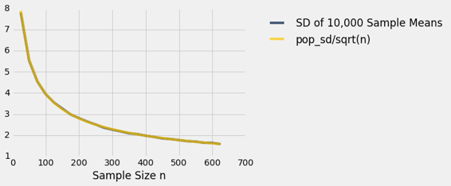

那里确实有两条曲线。但他们彼此如此接近，看起来好像只有一个。

我们看到了一个普遍结果的实例。 请记住，上面的图表基于每个样本量的 10,000 个重复。 但是每个样本量有超过 10,000 个样本。 样本均值的概率分布基于大小固定的所有可能样本的均值。

固定样本大小。如果样本是从总体中带放回随机抽取的：


这是所有可能样本均值的标准差。 它大致衡量了样本均值与总体均值的差距。

### 用于样本均值的中心极限定律

如果从总体中带放回地抽取大型随机样本，那么不管总体分布情况如何，样本均值的概率分布大致是正态的，以总体均值为中心，标准等于总体标准差除以样本量的平方根。

### 样本均值的准确性

所有可能的样本均值的标准差表示样本均值的变化程度。因此，它被视为样本均值作为总体均值的估计的准确度的一个度量。标准差越小，估计越准确。

公式表明：

+   总体大小不影响样本均值的准确性。公式中的任何地方都没有出现总体大小。
+   总体标准差是一个常数；从总体中抽取的每个样本都是一样的。样本量可以变化。由于样本量出现在分母中，样本均值的可变性随着样本量的增加而降低，因此准确度增加。

### 平方根法则


从标准差比较表中可以看出，25 次航班延误的随机样本的均值的标准差约为 8 分钟。 如果你将样本量乘以 4，你将得到大小为 100 的样本。所有这些样本的均值的标准差约为 4 分钟。 这比 8 分钟还小，但并不是 4 倍，只有 2 倍。 这是因为分母中的样本量上面有一个平方根。 样本量增加了 4 倍，但标准差下降了`2 = sqrt(4)`倍。 换句话说，准确度上升了`2 = sqrt(4)`倍。

一般来说，当你将样本量乘以一个因数时，样本均值的准确度将会上升该因数的平方根。

所以为了提高 10 倍的准确度，你必须将样本量乘以 100 倍。精度并不便宜！

## 选取样本量

候选人 A 在大选中竞选。一个投票机构想要估计投票给她的选民的比例。假设他们打算随机抽取选民，但实际上他们的抽样方法会更复杂。他们如何决定样本应该多大，才能达到理想的准确度？

在作出一些假设之后，我们现在可以回答这个问题：

+   选民人数非常多，所以我们可以假定随机样本带放回地抽取。
+   投票机构将通过为候选人 A 的选民百分比，构建一个约 95% 置信区间来做出估计。
+   准确度的理想水平是间隔宽度不应超过 1%。这非常准确！例如，置信区间`(33.2%, 34%)`可以，但`(33.2％, 35％)`不行。
+   我们将以候选人 A 的选民比例为例。回想一下，比例是一个平均值，其中总体中的值只有 0（你不计算的个体类型）或 1（你计算的个体类型）。

### 置信区间的宽度

如果我们有一个随机样本，我们可以使用自举法为候选人 A 的选民百分比构建一个置信区间。但是我们还没有样本 - 我们试图找出样本有多大，为了让我们的置信区间如我们所希望的那样狭窄。

在这样的情况下，了解理论预测的结果会有帮助。

中心极限定律表明，样本比例大致是正态分布的，以总体中 1 的比例为中心，标准差等于总体中 0 和 1 的标准差除以样本量的平方根。

所以即使我们不能把自己的目标作为自举比例的第 2.5 和第 97.5 个百分点，那么置信区间仍然是正态分布的“中间 95%”。

有没有另外一种方法来求出间隔有多大？是的，因为我们知道对于正态分布变量，“中心上下两个标准差”的间隔包含 95% 的数据。

置信区间将延伸到样本比例的两个标准差，位于中心的任一侧。因此，间隔的宽度将是样本比例的 4 个标准差。

我们愿意容忍`1% = 0.01`的宽度。因此，使用上一节中开发的公式：


所以：


### 01 集合的标准差

如果我们知道总体的标准差，我们就完成了。 我们可以计算样本量的平方根，然后取平方得到样本量。 但我们不知道总体的标准差。 总体中，候选人 A 的每个选民为 1，其余选民为 0，我们不知道每种选民的比例是多少。 这就是我们正在估计的。

那么我们卡住了吗？ 不，因为我们可以限制人口的标准差。 这里是两个这样的分布的直方图，一个是相等比例的 1 和 0 ，另一个是 90% 的 1 和 10% 的 0。 哪一个标准差更大？

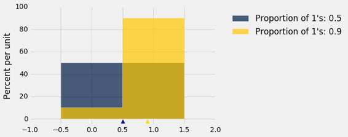

请记住，总体中的可能值只有 0 和 1。

蓝色直方图（50% 的 1 和 50% 的 0）比金色延展度更大。 它的均值是 0.5。 距离均值的偏差，一半等于 0.5，另一半等于 -0.5，所以标准差是 0.5。

在金色直方图中，所有的区域都挤压在 1 左右，从而延展度更小。 90% 的偏差很小，为 0.1。 其他的 10% 是 -0.9 ，较大，但总体上的延展度比蓝色直方图小。

如果我们改变 1 的比例或者让 0 的比例大于 1 的比例，那么同样的观察也成立。 我们通过计算不同比例，只包含 0 和 1 的 10 个元素的总体的标准差来检查它。 函数`np.ones`对此很有用。 它接受一个正整数作为它的参数，并返回一个由多个 1 组成的数组。

```py
sd = make_array()
for i in np.arange(1, 10, 1):
    # Create an array of i 1's and (10-i) 0's
    population = np.append(np.ones(i), 1-np.ones(10-i))
    sd = np.append(sd, np.std(population))

zero_one_sds = Table().with_columns(
    "Population Proportion of 1's", np.arange(0.1, 1, 0.1),
    "Population SD", sd
)

zero_one_sds
```


| Population Proportion of 1's | Population SD |
| --- | --- |
| 0.1 | 0.3 |
| 0.2 | 0.4 |
| 0.3 | 0.458258 |
| 0.4 | 0.489898 |
| 0.5 | 0.5 |
| 0.6 | 0.489898 |
| 0.7 | 0.458258 |
| 0.8 | 0.4 |
| 0.9 | 0.3 |

毫不奇怪，10% 的 1 和 90% 的 0 的总体标准差，与 90% 的 1 和 10% 的 0 的总体标准差相同。 那是因为你把直方图的一个条和两一个条互换，延展度没有变化。

更重要的是，出于我们的目的，标准差随着 1 的比例增加而增加，直到 1 的比例为 0.5；然后开始对称下降。

```py
zero_one_sds.scatter("Population Proportion of 1's")
```

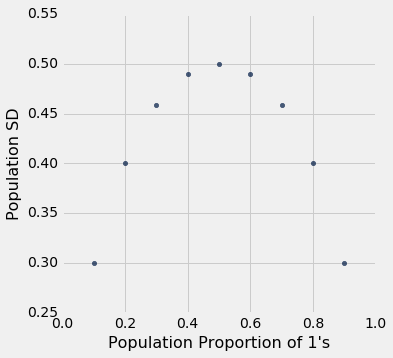

总结：01 总体的标准差最大为 0.5。 当 50% 的总体为 1 而另外 50% 为 0 时，这就是标准差的值。

### 样本量

我们知道了 ，并且 01 总体的标准差最大为 0.5，无论总体中 1 的比例。 所以这样是安全的：


所以样本量应该至少是`200 ^ 2 = 40,000`。 这是一个巨大的样本！ 但是，如果你想以较高的置信度确保高精度，不管总体是什么样子，那就是你所需要的。
