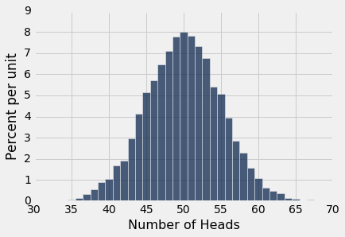
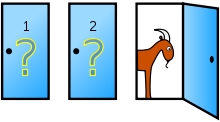
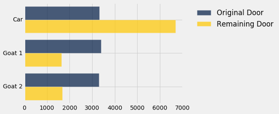
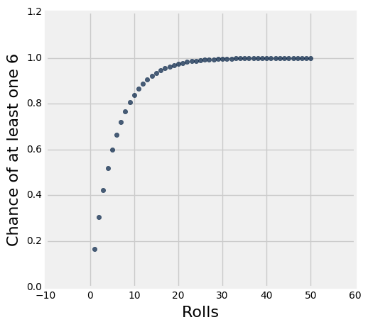

# 八、随机性

> 原文：[Randomness](https://github.com/data-8/textbook/tree/gh-pages/chapters/08)

> 译者：[飞龙](https://github.com/wizardforcel)

> 协议：[CC BY-NC-SA 4.0](http://creativecommons.org/licenses/by-nc-sa/4.0/)

> 自豪地采用[谷歌翻译](https://translate.google.cn/)

在前面的章节中，我们开发了深入描述数据所需的技能。 数据科学家也必须能够理解随机性。 例如，他们必须能够随机将个体分配到实验组和对照组，然后试图说明，观察到的两组结果之间的差异是否仅仅是由于随机分配，或真正由于实验所致。

在这一章中，我们开始分析随机性。 首先，我们将使用 Python 进行随机选择。 在`numpy`中有一个叫做`random`的子模块，它包含许多涉及随机选择的函数。 其中一个函数称为`choice`。 它从一个数组中随机选取一个项目，选择任何项目都是等可能的。 函数调用是`np.random.choice(array_name)`，其中`array_name`是要从中进行选择的数组的名称。

因此，下面的代码以 50% 的几率求值为`treatment`，50% 的机率为`control`。

```py
two_groups = make_array('treatment', 'control')
np.random.choice(two_groups)
'treatment'
```

上面的代码和我们迄今运行的所有其他代码之间的巨大差异在于，上面的代码并不总是返回相同的值。 它可以返回`treatment`或`control`，我们不会提前知道会选择哪一个。 我们可以通过提供第二个参数来重复这个过程，它是重复这个过程的次数。

```py
np.random.choice(two_groups, 10)
array(['treatment', 'control', 'treatment', 'control', 'control',
       'treatment', 'treatment', 'control', 'control', 'control'], 
      dtype='<U9')
```

随机事件的根本问题是它们是否发生。 例如：

+   个体是否被分配到实验组？
+   赌徒是否会赢钱？
+   一个民意调查是否做出了准确的预测？

一旦事件发生，你可以对所有这些问题回答“是”或“否”。 在编程中，通常通过将语句标记为`True`或`False`来执行此操作。 例如，如果个体被分配到实验组，那么“个体被分配到实验组”的陈述将是真的。 如果不是，那将是假的。

## 布尔值和比较

在 Python 中，布尔值（以逻辑学家 George Boole 命名）表示真值，并只有两个可能的值：`True`和`False`。 无论问题是否涉及随机性，布尔值通常都由比较运算符产生。 Python 包含了各种比较值的运算符。 例如，`3`大于`1 + 1`。

```py
3 > 1 + 1
True
```

`True`表示比较是有效的；Python 已经证实了`3`和`1 + 1`的关系的这个简单事实。 下面列出了一整套通用的比较运算符。


| 比较 | 运算符 | True 示例 | False 示例 |
| --- | --- |
| 小于 | `<` | `2 < 3` | `2 < 2` |
| 大于 | `>` | `3 > 2` | `3 > 3` |
| 小于等于 | `<=` | `2 <= 2` | `3 <= 2` |
| 大于等于 | `>=` | `3 >= 3` | `2 >= 3` |
| 等于 | `==` | `3 == 3` | `3 == 2` |
| 不等于 | `!=` | `3 != 2` | `2 != 2` |

注意比较中的两个等号`==`用于确定相等性。 这是必要的，因为 Python 已经使用`=`来表示名称的赋值，我们之前看到过。 它不能将相同的符号用于不同的目的。 因此，如果你想检查`5`是否等于`10/2`，那么你必须小心：`5 = 10/`2返回一个错误信息，因为 Python 假设你正试图将表达式`10/2`的值赋给一个名称，它是数字`5`。相反，你必须使用`5 == 10/2`，其计算结果为`True`。

```py
5 = 10/2
  File "<ipython-input-4-5c7d3e808777>", line 1
    5 = 10/2
            ^
SyntaxError: can't assign to literal
5 == 10/2
True
```

一个表达式可以包含多个比较，并且它们都必须满足，为了整个表达式为真。 例如，我们可以用下面的表达式表示`1 + 1`在`1`和`3`之间。

```py
1 < 1 + 1 < 3
True
```

两个数字的平均值总是在较小的数字和较大的数字之间。 我们用下面的数字`x`和`y`来表示这种关系。 你可以尝试不同的`x`和`y`值来确认这种关系。

```py
x = 12
y = 5
min(x, y) <= (x+y)/2 <= max(x, y)
True
```

### 字符串比较

字符串也可以比较，他们的顺序是字典序。 较短的字符串小于以较短的字符串开头的较长的字符串。

```py
'Dog' > 'Catastrophe' > 'Cat'
```

我们回到随机选择。 回想一下由两个元素组成的数组`two_groups`，`treatment`和`control`。 为了看一个随机分配的个体是否去了实验组，你可以使用比较：

```py
np.random.choice(two_groups) == 'treatment'
False
```

和以前一样，随机选择并不总是一样的，所以比较的结果也不总是一样的。 这取决于是选择`treatment`还是`control`。 对于任何涉及随机选择的单元格，多次运行单元格来获得结果的变化是一个好主意。

## 比较数组和值

回想一下，我们可以对数组中的很多数字执行算术运算。 例如，`make_array(0, 5, 2)*2`等同于`make_array(0, 10, 4)`。 以类似的方式，如果我们比较一个数组和一个值，则数组的每个元素都与该值进行比较，并将比较结果求值为布尔值数组。

```py
tosses = make_array('Tails', 'Heads', 'Tails', 'Heads', 'Heads')
tosses == 'Heads'
array([False,  True, False,  True,  True], dtype=bool)
```

`numpy`方法`count_nonzero`计算数组的非零（即`True`）元素的数量。

```py
np.count_nonzero(tosses == 'Heads')
3
```

## 条件语句

在许多情况下，行动和结果取决于所满足的一组特定条件。例如，随机对照试验的个体如果被分配给实验组，则接受实验。赌徒如果赢了赌注就赚钱。

在本节中，我们将学习如何使用代码来描述这种情况。条件语句是一个多行语句，它允许 Python 根据表达式的真值选择不同的选项。虽然条件语句可以出现在任何地方，但它们通常出现在函数体内，以便根据参数值执行可变的行为。

条件语句总是以`if`开头，这是一行，后面跟着一个缩进的主体。只有当`if`后面的表达式（称为`if`表达式）求值为真时，才会执行主体。如果`if`表达式的计算结果为`False`，则跳过`if`的主体。

让我们开始定义一个返回数字符号的函数。

```py
def sign(x):

    if x > 0:
        return 'Positive'
sign(3)
'Positive'
```

如果输入是正数，则此函数返回正确的符号。 但是，如果输入不是正数，那么`if`表达式的计算结果为`false`，所以`return`语句被跳过，函数调用没有值（为`None`）。

```py
sign(-3)
```

所以，让我们改进我们的函数来返回负数，如果输入是负数。 我们可以通过添加一个`elif`子句来实现，其中`elif`是 Python 的`else, if`的缩写。

```py
def sign(x):

    if x > 0:
        return 'Positive'

    elif x < 0:
        return 'Negative'
```

现在当输入为`-3`时，`sign`返回正确答案。

```py
sign(-3)
'Negative'
```

那么如果输入是`0`呢？为了处理这个情况，我们可以添加`elif`子句：

```py
def sign(x):

    if x > 0:
        return 'Positive'

    elif x < 0:
        return 'Negative'

    elif x == 0:
        return 'Neither positive nor negative'
sign(0)
'Neither positive nor negative'
```

与之等价，我们可以用`else`子句替换最后的`elif`子句，只有前面的所有比较都是`false`，才会执行它的正文。 也就是说，输入值等于`0`的时候。

```py
def sign(x):

    if x > 0:
        return 'Positive'

    elif x < 0:
        return 'Negative'

    else:
        return 'Neither positive nor negative'
sign(0)
'Neither positive nor negative'
```

### 一般形式

条件语句也可以有多个具有多个主体的子句，只有其中一个主体可以被执行。 多子句的条件语句的一般格式如下所示。

```py
if <if expression>:
    <if body>
elif <elif expression 0>:
    <elif body 0>
elif <elif expression 1>:
    <elif body 1>
...
else:
    <else body>
```

总是只有一个`if`子句，但是可以有任意数量的`elif`子句。 Python 将依次求解头部的`if`和`elif`表达式，直到找到一个真值，然后执行相应的主体。 `else`子句是可选的。 当提供`else`头部时，只有在前面的子句的头部表达式都不为真时才执行`else`头部。 `else`子句必须总是在最后（或根本没有）。

### 示例："另一个"

现在我们将使用条件语句来定义一个看似相当虚假和对立的函数，但是在本章后面的章节中会变得方便。 它需要一个数组，包含两个元素（例如，`red`和`blue`），以及另一个用于比较的元素。 如果该元素为`red`，则该函数返回`blue`。 如果元素是（例如）`blue`，则函数返回`red`。 这就是为什么我们要将函数称为`other_one`。

```py
def other_one(x, a_b):

    """Compare x with the two elements of a_b;
    if it is equal to one of them, return the other one;
    if it is not equal to either of them, return an error message.
    """
    if x == a_b.item(0):
        return a_b.item(1)

    elif x == a_b.item(1):
        return a_b.item(0)

    else:
        return 'The input is not valid.'
colors = make_array('red', 'blue')
other_one('red', colors)
'blue'
other_one('blue', colors)
'red'
other_one('potato', colors)
'The input is not valid.'
```

## 迭代

编程中经常出现这样的情况，特别是在处理随机性时，我们希望多次重复一个过程。 例如，要检查`np.random.choice`是否实际上是随机选取的，我们可能需要多次运行下面的单元格，以查看`Heads`是否以大约 50% 的几率出现。

```py
np.random.choice(make_array('Heads', 'Tails'))
'Heads'
```

我们可能希望重新运行代码，带有稍微不同的输入或其他稍微不同的行为。 我们可以多次复制粘贴代码，但是这很枯燥，容易出现拼写错误，如果我们想要这样做一千次或一百万次，忘记它吧。

更自动化的解决方案是使用`for`语句遍历序列的内容。 这被称为迭代。 `for`语句以单词`for`开头，后面跟着一个名字，我们要把这个序列中的每个项目赋给它，后面跟着单词`in`，最后以一个表达式结束，它求值为一个序列。 对于序列中的每个项目，`for`语句的缩进主体执行一次。

```py
for i in np.arange(3):
    print(i)
0
1
2
```

想象一下，没有`for`语句的情况下，完全实现`for`语句功能的代码，这样很有帮助。 （这被称为循环展开。）`for`语句简单地复制了内部的代码，但是在每次迭代之前，它从给定的序列中将我们选择的名称赋为一个新的值。 例如，以下是上面循环的展开版本：

```py
i = np.arange(3).item(0)
print(i)
i = np.arange(3).item(1)
print(i)
i = np.arange(3).item(2)
print(i)
0
1
2
```

> 译者注：实际的实现方式不是这样，但是效果一样。这里不做深究。

请注意，我的名字是任意的，就像我们用`=`赋值的名字一样。

在这里我们用一个更为现实的方式使用`for`语句：我们从数组中打印`5`个随机选项。

```py
coin = make_array('Heads', 'Tails')

for i in np.arange(5):
    print(np.random.choice(make_array('Heads', 'Tails')))
Heads
Heads
Tails
Heads
Heads
```

在这种情况下，我们只执行了几次完全相同的（随机）操作，所以我们`for`语句中的代码实际上并不涉及到`i`。

### 扩展数组

虽然上面的`for`语句确实模拟了五次硬币投掷的结果，但结果只是简单地打印出来，并不是我们可以用来计算的形式。 因此，`for`语句的典型用法是创建一个结果数组，每次都扩展它。

`numpy`中的`append`方法可以帮助我们实现它。 调用`np.append(array_name，value)`将求出一个新的数组，它是由`value`扩展的`array_name`。在使用`append`时请记住，数组的所有条目必须具有相同的类型。

```py
pets = make_array('Cat', 'Dog')
np.append(pets, 'Another Pet')
array(['Cat', 'Dog', 'Another Pet'], 
      dtype='<U11')
```

这会使`pets`数组保持不变。

```py
pets
array(['Cat', 'Dog'], 
      dtype='<U3')
```

但是在扩展数组的时候，通常使用`for`循环来修改它很方便。 这通过将扩展后的数组赋给原始数组的相同名称来实现。

```py
pets = np.append(pets, 'Another Pet')
pets
array(['Cat', 'Dog', 'Another Pet'], 
      dtype='<U11')
```

### 示例：计算正面的数量

现在我们可以模拟一个硬币的五次投掷，并把结果放入一个数组中。 我们将从创建一个空数组开始，然后附加每次投掷的结果。

```py
coin = make_array('Heads', 'Tails')

tosses = make_array()

for i in np.arange(5):
    tosses = np.append(tosses, np.random.choice(coin))

tosses
array(['Tails', 'Heads', 'Tails', 'Heads', 'Tails'], 
      dtype='<U32')
```

让我们将`for`语句展开，重写单元格。

```py
coin = make_array('Heads', 'Tails')

tosses = make_array()

i = np.arange(5).item(0)
tosses = np.append(tosses, np.random.choice(coin))
i = np.arange(5).item(1)
tosses = np.append(tosses, np.random.choice(coin))
i = np.arange(5).item(2)
tosses = np.append(tosses, np.random.choice(coin))
i = np.arange(5).item(3)
tosses = np.append(tosses, np.random.choice(coin))
i = np.arange(5).item(4)
tosses = np.append(tosses, np.random.choice(coin))

tosses
array(['Heads', 'Heads', 'Tails', 'Tails', 'Heads'], 
      dtype='<U32')
```

通过将结果捕获到数组中，我们自己有能力使用数组方法进行计算。 例如，我们可以使用`np.count_nonzero`来计算五次投掷中的正面数量。

```py
np.count_nonzero(tosses == 'Heads')
2
```

迭代是一个强大的技术。 例如，通过为 1000 次投掷运行完全相同的代码，而不是`5`次，我们可以计算`1000`次投掷的正面数量。

```py
tosses = make_array()

for i in np.arange(1000):
    tosses = np.append(tosses, np.random.choice(coin))

np.count_nonzero(tosses == 'Heads')
481
```

## 示例：100 次投掷中的正面数量

预测 100 次硬币投掷中有 50 个正面是很自然的，或多或少。

但多少是“或多或少”呢？ 获得正好 50 个正面的几率是多少？ 像数据科学这样的问题，不仅因为它们涉及随机性的有趣方面，而且因为它们可以用于分析试验，其中实验和控制组的分配由硬币的投掷决定。

在这个例子中，我们将模拟以下实验的 10,000 次重复：

+   掷硬币 100 次，记录正面数量。

我们的结果的直方图会让我们了解有多少个正面。

作为一个预热，请注意，`np.random.choice`接受可选的第二个参数来指定选择的数量。 默认情况下，选择使用替换来进行。 这里是一个硬币 10 次投掷的模拟：

```py
np.random.choice(coin, 10)
array(['Tails', 'Heads', 'Heads', 'Tails', 'Tails', 'Heads', 'Tails',
       'Tails', 'Heads', 'Tails'], 
      dtype='<U5')
```

现在我们来研究 100 次投掷。 我们将首先创建一个名为`heads`的空数组。 然后，在每个一万次重复中，我们会抛硬币 100 次，计算正面的数量，并将其附加到`heads`上。

```py
N = 10000

heads = make_array()

for i in np.arange(N):
    tosses = np.random.choice(coin, 100)
    heads = np.append(heads, np.count_nonzero(tosses == 'Heads'))

heads
array([ 46.,  64.,  59., ...,  56.,  54.,  56.])
```

让我们将结果收集到表格中，并绘制直方图：

```py
results = Table().with_columns(
    'Repetition', np.arange(1, N+1),
    'Number of Heads', heads
)

results
```


| Repetition | Number of Heads |
| --- | --- |
| 1 | 46 |
| 2 | 64 |
| 3 | 59 |
| 4 | 57 |
| 5 | 54 |
| 6 | 47 |
| 7 | 45 |
| 8 | 50 |
| 9 | 44 |
| 10 | 57 |

（省略了 9990 行）

这里是数据的直方图，桶的宽度为 1，中心为每个正面数量的值。

```py
results.select('Number of Heads').hist(bins=np.arange(30.5, 69.6, 1))
```



毫不奇怪，直方图看起来大约关于 50 个正面左右对称。 50 处的条形的高度大约是每单位 8%。 由于每个条形的宽度都是 1 个单位，这就是说，8% 的重复正好产生了 50 个正面。 这不是一个很大的百分比，但是与其他数量的正面相比，这是最大的。

直方图还显示，在几乎所有的重复中，100 次投掷的正面数量在 35 到 65 之间。事实上，大部分的重复产生 45 到 55 个正面数量。

理论上，正面数量可能在 0 到 100 之间，但模拟显示可能值的范围要小得多。

这是一个更普遍现象的例子，关于掷硬币中的变化，我们将在后面看到。

## Monty Hall 问题

多年来这个问题已经使许多人感到困惑，包括数学家在内。 让我们看看我们是否可以解决。

这个设定来源于一个名为“让我们做个交易”（Let's Make a Deal）的电视游戏节目。Monty Hall 在二十世纪六十年代主持了这个节目，从此产生了一些副产品。 这个节目令人兴奋的一部分是，虽然参赛者有机会赢得大奖，但他们可能最终会选择不那么理想的“zonks”。 这就是现在所谓的 Monty Hall 问题的基础。

这个设定是一个游戏节目，参赛者面对三个闭着的门。 在其中一扇门的后面是一辆奇特的汽车，另外两扇门后面有一只山羊。 参赛者不知道汽车的位置，必须按照以下规则进行尝试。

+   参赛者进行初步选择，但不打开那个门。
+   其他两个门中至少有一个门的后面必须有一只山羊。Monty 打开这些门之一来展示山羊，[维基百科](https://en.wikipedia.org/wiki/Monty_Hall_problem)中显示了他所有的荣耀。



+   还剩下两个门，其中一个是参赛者的原始选择。 其中一扇门后面有车，另一扇有一只山羊。 参赛者现在可以选择打开两扇门中的哪一扇。

参赛者需要作出决定。 如果她想要这辆车，她应该选择打开哪扇门？ 她应该坚持最初的选择，还是转向另一个门？ 这是 Monty Hall 问题。

### 解法

在涉及几率的任何问题中，重要的随机性的假设。 假设有三分之一的几率，参赛者的最初选择是后面有车的门，这是合理的。

在这个假设下，解决这个问题的方法非常简单，尽管简单的解决方案并不能说服每个人。 无论如何就是这样。

+   汽车在原来选择的门后面的几率是 1/3。
+   汽车在原来选择的门后面或者剩余的门后面。 它不能在其他地方。
+   因此，汽车在剩余的门后的几率是 2/3。
+   因此，选手应该更改选择。
+   就是这样，故事结束了。

不相信？ 那么让我们模拟游戏，看看结果如何。

### 模拟

我们开始建立两个实用的数组，`doors`和`goats`，这会让我们区分三个门和两只山羊。

```py
doors = make_array('Car', 'Goat 1', 'Goat 2')
goats = make_array('Goat 1', 'Goat 2')
```

现在我们定义一个函数`monty_hall`来模拟游戏，并按照这个顺序返回含有三个字符串的数组：

+   参赛选手的原始选择的什么
+   Monty 排除了什么
+   剩下的门是什么

如果选手的原始选择是带山羊的门，蒙蒂必须扔掉另一只山羊，剩下的就是这辆车。 如果最初的选择是带车的门，蒙蒂必须扔掉两只山羊中的一只，剩下的就是另一只羊。

因此很显然，在前一节中定义的函数将是有用的。 它需要一个字符串和一个两个元素的数组; 如果字符串等于其中一个元素，则返回另一个元素。

```py
def other_one(x, a_b):
    if x == a_b.item(0):
        return a_b.item(1)
    elif x == a_b.item(1):
        return a_b.item(0)
    else:
        return 'Input Not Valid'
```

如果选手的原始选择是山羊，游戏的结果是这二者之一：

```py
original = 'Goat 1'
make_array(original, other_one(original, goats), 'Car')
array(['Goat 1', 'Goat 2', 'Car'], 
      dtype='<U6')
original = 'Goat 2'
make_array(original, other_one(original, goats), 'Car')
array(['Goat 2', 'Goat 1', 'Car'], 
      dtype='<U6')
```

现在我们可以把所有这些代码放到`monty_hall`函数中，来模拟一次游戏的结果。 该函数不带任何参数。

参赛者的原始选择将是三门之中随机选择的门。

为了检查原始选择是否是山羊，我们首先写一个名为`is_goat`的小函数：

```py
def is_goat(door_name):

    """ Check whether the name of a door (a string) is a Goat.
    
    Examples:
    =========
    
    >>> is_goat('Goat 1')
    True
    >>> is_goat('Goat 2')
    True
    >>> is_goat('Car')
    False
    """
    if door_name == "Goat 1":
        return True
    elif door_name == "Goat 2":
        return True
    else:
        return False


def monty_hall():

    """ Play the Monty Hall game once
    and return an array of three strings:
    
    original choice, what Monty throws out, what remains
    """

    original = np.random.choice(doors)

    if is_goat(original):
        return make_array(original, other_one(original, goats), 'Car')

    else:
        throw_out = np.random.choice(goats)
        return make_array(original, throw_out, other_one(throw_out, goats))
```

让我们玩几次这个游戏。这里是一个结果。你应该运行几次单元格来观察结果如何变化。

```py
monty_hall()
array(['Car', 'Goat 2', 'Goat 1'], 
      dtype='<U6')
```

为了衡量不同结果发生的频率，我们必须玩多次游戏并收集结果。 为此，我们将使用`for`循环。

我们将首先定义三个空数组，每个数组对应原始选择，Monty 排除了什么，剩下的是什么。然后我们将玩这个游戏 N 次并收集结果。我们已经将 N 设为 10,000，但是你可以改变它。

```py
# Number of times we'll play the game
N = 10000

original = make_array()     # original choice
throw_out = make_array()    # what Monty throws out
remains = make_array()      # what remains

for i in np.arange(N): 
    result = monty_hall()    # the result of one game

    # Collect the results in the appropriate arrays
    original = np.append(original, result.item(0))
    throw_out = np.append(throw_out, result.item(1))
    remains = np.append(remains, result.item(2))

# The for-loop is done! Now put all the arrays together in a table.
results = Table().with_columns(
    'Original Door Choice', original,
    'Monty Throws Out', throw_out,
    'Remaining Door', remains
)
results
```

| Original Door Choice | Monty Throws Out | Remaining Door |
| --- | --- | --- |
| Car | Goat 1 | Goat 2 |
| Goat 1 | Goat 2 | Car |
| Goat 2 | Goat 1 | Car |
| Car | Goat 2 | Goat 1 |
| Car | Goat 2 | Goat 1 |
| Goat 1 | Goat 2 | Car |
| Goat 1 | Goat 2 | Car |
| Goat 1 | Goat 2 | Car |
| Goat 2 | Goat 1 | Car |
| Goat 1 | Goat 2 | Car |

（省略了 9990 行）

为了看看选手是否应该坚持原来的选择或更改，让我们看看她的两个选项后面的车的频率。

```py
results.group('Original Door Choice')
```


| Original Door Choice | count |
| --- | --- |
| Car | 3312 |
| Goat 1 | 3382 |
| Goat 2 | 3306 |

```py
results.group('Remaining Door')
```


| Remaining Door | count |
| --- | --- |
| Car | 6688 |
| Goat 1 | 1640 |
| Goat 2 | 1672 |

我们的解决方案说明了，这辆车有三分之二的几率在剩下的门后面，这是相当不错的近似值。 如果参赛者更改了她的选择，她有两倍的可能性会得到车。

为了使结果可视化，我们可以将上面的两个表格连接在一起并绘制叠加的条形图。

```py
results_o = results.group('Original Door Choice')
results_r = results.group('Remaining Door')
joined = results_o.join('Original Door Choice', results_r, 'Remaining Door')
combined = joined.relabeled(0, 'Item').relabeled(1, 'Original Door').relabeled(2, 'Remaining Door')
combined
```


| Item | Original Door | Remaining Door |
| --- | --- | --- |
| Car | 3312 | 6688 |
| Goat 1 | 3382 | 1640 |
| Goat 2 | 3306 | 1672 |

```py
combined.barh(0)
```



注意三条蓝色条形几乎相等 - 原始选择有同等可能是三个可用条目中的任何一条。 但是，汽车对应的金色条形是蓝色条形的两倍。

模拟证实了，如果参赛者改变选择，她有两倍的可能性获胜。

## 发现概率

几个世纪以来，对于什么是概率存在哲学争论。有些人认为概率是相对频率；其他人认为他们是长期的相对频率较长；还有一些人认为概率是个人不确定性程度的主观测量。

在这个课程中，大多数概率将是相对频率，尽管许多人会有主观的解释。无论如何，在不同的解释中，概率计算和组合的方式是一致的。

按照惯例，概率是介于 0 和 1 之间的数字，或者 0% 和 100% 之间。不可能的事件概率为 0。确定的事件概率为 1。

数学是准确发现概率的主要工具，尽管计算机也可用于此目的。模拟可以提供出色的近似，具有很高的概率。在本节中，我们将以非正式方式制定一些简单的规则来管理概率的计算。在随后的章节中，我们将回到模拟来近似复杂事件的概率。

我们将使用标准符号  来表示“事件”发生的概率，我们将交替使用“几率”和“概率”两个字。

## 事件不会发生的时候

如果事件发生的概率是 40%，不发生的几率就是 60%。这个自然的计算可以这样秒速：


## 所有结果等可能的时候

如果你投掷一个普通的骰子，一个自然的假设是，所有六个面都是等可能的。 那么一个面出现的概率可以很容易地计算出来。 例如，骰子显示偶数的几率是：


与之相似：


通常：


前提是所有的结果都是等可能的。

并非所有的随机现象都像骰子一样简单。 下面的两个主要的概率规则甚至允许数学家在复杂的情况下找到概率。

## 两个事件必须同时发生时

假设你有一个盒子，包含三张纸条：一张红色，一张蓝色和一张绿色。 假设你随机抽两张纸条而不放回；也就是你把三张纸条打乱，抽一张，打乱其余两张，再从这两张中抽出一张。 你先得到绿色纸条，然后是红色纸条的几率是多少？

有六种可能的颜色对：RB，BR，RG，GR，BG，GB（我们已经缩写了每种颜色的名字，就是它的第一个字母）。 所有这些都是抽样方案是等可能的，只有其中一个（GR）使事件发生。所以：


但是还有另外一种方法来得到答案，可以用两个阶段来思考这个事件。 必须首先抽取绿色纸条。几率是 1/3，也就是说在所有实验的大约 1/3 的重复中，先抽取了绿色纸条，但事件还没完成。在这 1/3 的重复中，必须再次抽取红色纸条。这个发生在大约 1/2 的重复中，所以：


这个计算通常按照事件顺序，像这样：


因数 1/2 叫做“假设第一次出现了绿色纸条，第二次出现红色纸条的条件几率”。

通常，我们拥有乘法规则：


两个事件同时发生的概率，等于第一个事件发生的概率，乘上第一个事件发生的情况下第二个事件发生的概率。

因此，这里有两个条件 - 一个事件必须发生，另一个也是 - 几率是分数的分数，这比两个因数的任何一个都要小。 满足的条件越多，满足的可能性就越小。

## 事件以两种不同的方式发生

相反，假设我们希望两张纸条中的一张是绿色的，另一张是红色的。 此事件不指定颜色必须出现的顺序。所以他们可以以任何顺序出现。

解决这样的问题的一个好方法就是对事件进行划分，以便它正好能够以几种不同的方式之一发生。 “一绿一红”的自然划分是：GR，RG。

根据上面的计算，GR 和 RG 每个的几率都是 1/6。所以你可以通过把它们相加来计算一绿一红的概率。


通常，我们拥有加法规则：


事件发生的概率，等于以第一种方式发生的概率，加上以第二种方式发生的概率。

只要事件正好以两种方式之一发生。

因此，当事件以两种不同的方式之一发生时，发生的几率是一些几率的总和，因此比任何一种方式的几率都大。

乘法规则可以自然扩展到两个以上的事件，我们将在下面看到。 所以这个加法规则也有自然的扩展，事件可以以几种不同的方式之一发生。

我们将所有这些规则组合成示例，并用示例来结束该部分。

### 至少有一个成功

数据科学家经常使用来自人群的随机样本。 有时候问题就来了，就是人群中的一个特定个体选进样本的可能性。为了找出几率，这个人被称为“成功”，问题是要找到样本包含成功的几率。

要看看如何计算这样的几率，我们从一个更简单的设定开始：投掷硬币两次。

如果你投掷硬币两次，有四个等可能的结果：HH，HT，TH 和 TT。 我们把正面缩写为 H ，反面缩写为 T。至少有一个正面的几率是 3/4。

得出这个答案的另一种方法是，弄清楚如果你不能得到至少一个正面，会发生什么事情：这两次投掷都必须是反面。所以：


要注意根据乘法规则：


这两个观察使我们能够在任何给定数量的投掷中找到至少一个正面的几率。 例如：


而现在我们有能力找到在骰子的投掷中，六点至少出现一次的几率：


下表展示了，这些概率随着投掷数量从 1 增加到 50 而增加。

```py
rolls = np.arange(1, 51, 1)
results = Table().with_columns(
    'Rolls', rolls,
    'Chance of at least one 6', 1 - (5/6)**rolls
)
results
```


| Rolls | Chance of at least one 6 |
| --- | --- |
| 1 | 0.166667 |
| 2 | 0.305556 |
| 3 | 0.421296 |
| 4 | 0.517747 |
| 5 | 0.598122 |
| 6 | 0.665102 |
| 7 | 0.720918 |
| 8 | 0.767432 |
| 9 | 0.806193 |
| 10 | 0.838494 |

（省略了 40 行）

随着投掷数量的增加，六点至少出现一次的几率迅速增加。

```py
results.scatter('Rolls')
```



在 50 次投掷中，你几乎肯定能得到至少一个六。

```py
results.where('Rolls', are.equal_to(50))
```


| Rolls | Chance of at least one 6 |
| --- | --- |
| 50 | 0.99989 |


像这样的计算可以用来找到，随机样本中选择特定个体的几率。 准确的计算将取决于抽样方案。 但是我们上面的观察的通常可以被推广：增加随机样本的大小增加了选择个体的几率。

## 抽样

现在我们来仔细看看抽样，例子基于`top_movies.csv`数据集。

```py
top1 = Table.read_table('top_movies.csv')
top2 = top1.with_column('Row Index', np.arange(top1.num_rows))
top = top2.move_to_start('Row Index')

top.set_format(make_array(3, 4), NumberFormatter)
```


| Row Index | Title | Studio | Gross | Gross (Adjusted) | Year |
| --- | --- |
| 0 | Star Wars: The Force Awakens | Buena Vista (Disney) | 906,723,418 | 906,723,400 | 2015 |
| 1 | Avatar | Fox | 760,507,625 | 846,120,800 | 2009 |
| 2 | Titanic | Paramount | 658,672,302 | 1,178,627,900 | 1997 |
| 3 | Jurassic World | Universal | 652,270,625 | 687,728,000 | 2015 |
| 4 | Marvel's The Avengers | Buena Vista (Disney) | 623,357,910 | 668,866,600 | 2012 |
| 5 | The Dark Knight | Warner Bros. | 534,858,444 | 647,761,600 | 2008 |
| 6 | Star Wars: Episode I - The Phantom Menace | Fox | 474,544,677 | 785,715,000 | 1999 |
| 7 | Star Wars | Fox | 460,998,007 | 1,549,640,500 | 1977 |
| 8 | Avengers: Age of Ultron | Buena Vista (Disney) | 459,005,868 | 465,684,200 | 2015 |
| 9 | The Dark Knight Rises | Warner Bros. | 448,139,099 | 500,961,700 | 2012 |

（省略了 190 行）

### 对表格的行进行抽样

数据表的每一行代表一个个体；最重要的是，每个个体都是一部电影。 因此可以通过表格的行的抽样来实现对个体的抽样。

一行的内容是在同一个个体上测量的不同变量的值。 因此，行的内容的抽样形成了每个变量值的样本。

## 确定性样本

当你只是简单地指定，你要选择的集合中的哪些元素时，就不会涉及任何几率，可以创建确定性样本。

你已经做了很多次了，例如使用`take`：


```py
top.take(make_array(3, 18, 100))
```

| Row Index | Title | Studio | Gross | Gross (Adjusted) | Year |
| --- | --- |
| 3 | Jurassic World | Universal | 652,270,625 | 687,728,000 | 2015 |
| 18 | Spider-Man | Sony | 403,706,375 | 604,517,300 | 2002 |
| 100 | Gone with the Wind | MGM | 198,676,459 | 1,757,788,200 | 1939 |

你也使用了`where`：

```py
top.where('Title', are.containing('Harry Potter'))
```

| Row Index | Title | Studio | Gross | Gross (Adjusted) | Year |
| --- | --- |
| 22 | Harry Potter and the Deathly Hallows Part 2 | Warner Bros. | 381,011,219 | 417,512,200 | 2011 |
| 43 | Harry Potter and the Sorcerer's Stone | Warner Bros. | 317,575,550 | 486,442,900 | 2001 |
| 54 | Harry Potter and the Half-Blood Prince | Warner Bros. | 301,959,197 | 352,098,800 | 2009 |
| 59 | Harry Potter and the Order of the Phoenix | Warner Bros. | 292,004,738 | 369,250,200 | 2007 |
| 62 | Harry Potter and the Goblet of Fire | Warner Bros. | 290,013,036 | 393,024,800 | 2005 |
| 69 | Harry Potter and the Chamber of Secrets | Warner Bros. | 261,988,482 | 390,768,100 | 2002 |
| 76 | Harry Potter and the Prisoner of Azkaban | Warner Bros. | 249,541,069 | 349,598,600 | 2004 |

虽然这些是电影的样本，它们并不涉及几率。

### 概率抽样

很多数据科学都根据随机样本中的数据得到结论。 根据随机样本的正确解释分析，需要数据科学家准确地检查随机样本。

总体是从中抽取样本的所有元素的集合。

概率样本是一种样本，在抽取样本之前，可以计算出的元素的任何子集将进入样本的几率。

在概率样本中，所有的元素不需要有相同的选中几率。

### 随机抽样方案

例如，假设根据以下方案，从三个个体 A，B 和 C 组成的总体中选择两个个体：

+   个体 A 选中概率为 1。
+   个体 B 或 C 根据掷硬币来选择：如果硬币为正面，选择 B，否则，选择 C。

这是一个大小为 2 的概率样本。下面是所有非空子集的选中几率：

```py
A: 1 
B: 1/2
C: 1/2
AB: 1/2
AC: 1/2
BC: 0
ABC: 0
```

个体 A 比 B 或 C 有更高的选中几率；的确，个体 A 肯定会被选中。由于这些差异是已知的和量化的，所以在处理样本时可以考虑这些差异。

### 系统样本

想象一下，总体的所有元素都列出在序列中。 抽样的一种方法是，先从列表中选择一个随机的位置，然后是它后面的等间隔的位置。样本由这些位置上的元素组成。这样的样本被称为系统样本。

在这里，我们将选择顶部一些行的系统样本。我们最开始随机选取前 10 行中的一行，然后我们将选取它后面的每个第 10 行。

```py
"""Choose a random start among rows 0 through 9;
then take every 10th row."""

start = np.random.choice(np.arange(10))
top.take(np.arange(start, top.num_rows, 10))
```

| Row Index | Title | Studio | Gross | Gross (Adjusted) | Year |
| --- | --- |
| 6 | Star Wars: Episode I - The Phantom Menace | Fox | 474,544,677 | 785,715,000 | 1999 |
| 16 | Iron Man 3 | Buena Vista (Disney) | 409,013,994 | 424,632,700 | 2013 |
| 26 | Spider-Man 2 | Sony | 373,585,825 | 523,381,100 | 2004 |
| 36 | Minions | Universal | 336,045,770 | 354,213,900 | 2015 |
| 46 | Iron Man 2 | Paramount | 312,433,331 | 341,908,200 | 2010 |
| 56 | The Twilight Saga: New Moon | Sum. | 296,623,634 | 338,517,700 | 2009 |
| 66 | Meet the Fockers | Universal | 279,261,160 | 384,305,300 | 2004 |
| 76 | Harry Potter and the Prisoner of Azkaban | Warner Bros. | 249,541,069 | 349,598,600 | 2004 |
| 86 | The Exorcist | Warner Bros. | 232,906,145 | 962,212,800 | 1973 |
| 96 | Back to the Future | Universal | 210,609,762 | 513,740,700 | 1985 |

（省略了 10 行）

运行单元个几次，看看输出如何变化。

这个系统样本是一个概率样本。 在这个方案中，所有的行都有机会被选中。 例如，当且仅当第 3 行被选中时，第 23 行才被选中，并且其几率是 1/10。

但并不是所有的子集都有相同的选中几率。 由于选中的行是等间隔的，大多数行的子集都没有机会被选中。 唯一可能的子集是由所有间隔为 10 的行构成的子集。任何这些子集都以 1/10 的几率被选中。 其他子集，如包含表格前 11 行的子集，选中几率都是 0。

### 放回或不放回的随机抽样

在这个课程中，我们将主要处理两个最直接的抽样方法。

首先是带放回的随机抽样，它（如我们前面所见）是`np.random.choice`从数组中抽样时的默认行为。

另一个称为“简单随机样本”，是随机抽取的样本，不带放回。在下一个个体被抽中之前，抽中的个体不会放回总体。例如，当你发牌时，就会发生这种抽样。

在下一章中，我们将使用模拟来研究带放回和不放回的大样本随机抽取。

绘制随机样本需要谨慎和精确。这不是随便的，即使这是“随机”一词的口语意义。如果你站在街头，选取前十名经过的人作为样本，你可能会认为你在随机抽样，因为你没有选择谁走过。但它不是一个随机样本 - 这是一个方便的例子。你没有提前知道每个人进入样本的概率，也许甚至你没有具体指定谁在总体中。
